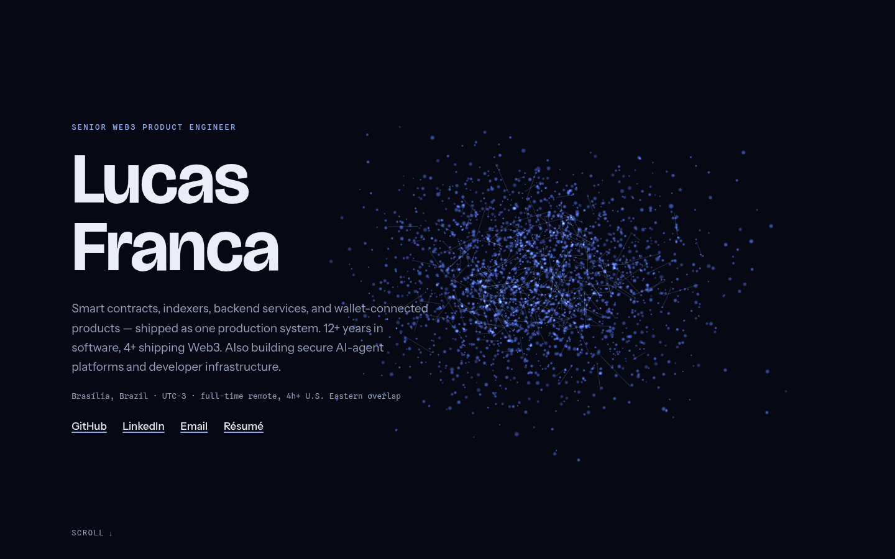

# lucasfranca.dev



**Live: [lucasfranca.dev](https://lucasfranca.dev)**

Single-page developer portfolio. Static files, no build step: Three.js loads
from a CDN via an import map.

One particle field runs behind the whole page and reorganizes as you scroll
into the shape of each career chapter — constellation (hero), quorum ring
(governance), execution lattice (agent platform), d20 wireframe (onchain
games) — then back to the constellation.

## Run

```sh
python3 -m http.server 8000
```

Then open http://localhost:8000. (A server is needed because `main.js` is an
ES module; `file://` won't work.)

## Validate

```sh
npm install
npm run validate   # html-validate on index.html
npm run links      # internal link/asset check
npm test           # Playwright smoke: desktop + mobile, axe accessibility scan
```

The same three checks run in CI on every push.

## Accessibility & motion

- The canvas is `aria-hidden` and never intercepts input; all content is
  plain HTML that works without WebGL or JavaScript.
- `prefers-reduced-motion`: the continuous render loop is replaced by
  single frames on scroll — no ambient drift, no idle spin.
- Rendering pauses when the tab is hidden.
- Case studies use native `<details>` — no JS.
- Visible keyboard focus throughout.

## Performance decisions

- Particle count derives from the lattice grid: 2,496 on desktop, ~1,000 on
  narrow viewports; device pixel ratio is clamped to 2.
- Formation morphs are computed in the vertex shader from two buffered
  attribute sets; the CPU rebuffers only when the scroll segment changes.
- No post-processing — additive blending and soft sprites do the glow.

## Browser support

Any evergreen browser with WebGL. Without WebGL the page renders as a
readable static document.

## Deploy

A Railway service is connected to this repo; every push to `main`
auto-deploys. No config files needed — the static files are served as-is.

## Files

- `index.html` — all content, copy, and metadata
- `style.css` — design tokens at the top of `:root`
- `main.js` — the Three.js scene: formations, scroll-driven morphing, shaders
- `resume/` — downloadable PDF résumés
- `tests/` — Playwright smoke tests

## License

MIT — see [LICENSE](LICENSE).
